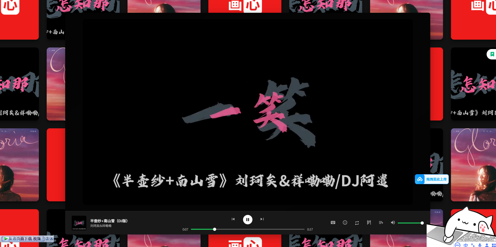

# Player - 一款高度可定制的现代媒体播放器



## 原作者地址

https://github.com/git-hub-cc/Player.git

## 简介

这是一个使用 HTML5、CSS 和原生 JavaScript (ES6+) 构建的现代、功能丰富的媒体播放器项目。**其界面深受 Spotify、JIEJOE 的启发**，旨在为播放本地或在线音视频文件提供美观、响应式且用户友好的界面。该项目不依赖任何前端框架（如 React 或 Vue），展示了原生 Web 技术的强大能力。

## ✨ 功能亮点

-   **现代 UI 设计**：界面灵感源自 Spotify、JIEJOE，提供简洁直观的用户体验，并配有骨架加载屏，提升初始加载体验。
-   **混合媒体支持**：无缝播放音频（如 MP3）和视频（如 MP4）文件，UI 会根据媒体类型自动适配。
-   **动态播放列表**：通过简单的 `playlist.json` 文件轻松管理和加载您的媒体队列。
-   **智能播放列表搜索**：播放列表面板支持通过标题、艺术家、**拼音**或**拼音首字母**进行模糊搜索。
-   **ID3 标签读取**：利用 `jsmediatags` 自动从 MP3 文件中提取封面、标题和艺术家信息，最大限度减少手动配置。
-   **动态 UI 背景**：对于音频播放，它能智能地从专辑封面中提取主色调，生成平滑优雅的渐变背景；对于视频播放，视频本身即成为视觉背景。
-   **同步歌词**：支持 LRC 格式的歌词，在播放过程中自动滚动并高亮显示当前行。
-   **多种播放模式**：一键点击即可在列表循环、单曲循环和随机播放模式之间轻松切换。
-   **功能导览**：首次访问的用户会收到引导式导览，突出显示关键功能，帮助他们快速上手。
-   **高度可定制的快捷键**：专用的设置面板允许用户录制和修改自己的键盘快捷键，用于播放/暂停、下一首、音量控制等常见操作。
-   **沉浸模式**：一键进入全屏模式，享受无干扰的沉浸式听觉或视觉体验。
-   **右键上下文菜单**：在页面任意位置右键单击，即可快速访问核心播放控制。
-   **完全响应式设计**：在宽屏桌面浏览器和移动设备上均能提供优化的布局和交互体验。
-   **侧边栏系统**：将播放列表、“关于”信息和快捷键设置组织成简洁、可收起的侧边栏，保持主界面整洁。

## 🚀 快速开始

1.  **克隆或下载项目**
    ```bash
    git clone https://github.com/git-hub-cc/Player.git
    cd Player
    ```

2.  **安装依赖**
    该项目依赖 `pinyin-pro` 库来实现其高级中文拼音搜索功能。请下载该库并将其放入 `lib` 文件夹中。
    -   [pinyin-pro 下载链接](https://github.com/zh-lx/pinyin-pro)
    -   确保文件路径为 `lib/index.min.js`。

3.  **启动本地服务器**
    由于浏览器安全策略（CORS），直接通过 `file://` 协议打开 `index.html` 可能会导致某些功能（如获取 `playlist.json`）无法正常工作。建议使用一个简单的本地服务器。

    如果你已安装 Node.js，可以使用 `http-server` 或 `live-server`：
    ```bash
    # 全局安装 live-server（如果尚未安装）
    npm install -g live-server
    
    # 在项目根目录下运行
    live-server
    ```
    或者，使用 Python 内置的 HTTP 服务器：
    ```bash
    # 对于 Python 3
    python -m http.server
    
    # 对于 Python 2
    python -m SimpleHTTPServer
    ```
    然后，在浏览器中打开提供的地址（例如 `http://127.0.0.1:8080`）。

## 🔧 如何配置

### 播放列表 (`playlist.json`)
你可以通过编辑项目根目录下的 `playlist.json` 文件来管理媒体内容。该文件是一个 JSON 数组，其中每个对象代表一个媒体曲目。

**曲目对象结构：**

| 键名       | 类型   | 描述                                                                                              | 是否必需 |
| ---------- | ------ | -------------------------------------------------------------------------------------------------------- | -------- |
| `title`    | string | 媒体的标题。                                                                                  | 是      |
| `artist`   | string | 艺术家或创作者。                                                                                   | 是      |
| `src`      | string | 媒体文件的路径（相对本地路径或 URL）。                                                 | 是      |
| `type`     | string | 媒体类型，为 `'audio'` 或 `'video'`。                                                           | 是      |
| `lyrics`   | string | LRC 格式的歌词文本。如果留空，则显示“暂无歌词”。                         | 否       |
| `albumArt` | string | 封面艺术的 URL。对于音频文件，如果未提供此信息，系统将尝试使用 `jsmediatags` 从文件的元数据中读取。 | 否       |

**示例：**
```json
[
  {
    "title": "歌曲 A",
    "artist": "艺术家 A",
    "src": "media/audio/song_a.mp3",
    "type": "audio",
    "lyrics": "[00:01.00]第一行歌词\n[00:05.50]第二行歌词",
    "albumArt": "media/art/album_a.jpg"
  },
  {
    "title": "视频 B",
    "artist": "创作者 B",
    "src": "media/video/video_b.mp4",
    "type": "video",
    "lyrics": ""
  }
]
```

## 🛠️ 技术栈

-   **核心**：HTML5, CSS3, JavaScript (ES6+, 模块)
-   **库**：
    -   [jsmediatags.js](https://github.com/aadsm/jsmediatags)：用于在客户端读取 MP3 文件的 ID3 元数据。
    -   [pinyin-pro](https://github.com/zh-lx/pinyin-pro)：用于实现强大的中文拼音搜索功能。

## 📄 资源与版权说明

**重要说明**：本项目中使用的所有媒体资源（包括但不限于音频和视频文件）均收集自互联网，仅用于学习和技术演示目的，不得用于商业用途。

具体媒体来源包括：
-   **在线平台**：抖音（TikTok）、Spotify
-   **艺术家/创作者**：旺仔小乔, 尹懿思¹²¹²（大力版）
-   **工具**：SPOTDOWNLOADER

所有媒体内容的版权均属于原作者或其各自的版权持有者。如果您是任何媒体内容的版权所有者，并认为其在本项目中的使用侵犯了您的权利，请与我们联系，我们将立即移除相关内容。

## 致谢

-   **Spotify**：为本项目提供了主要的 UI/UX 设计灵感，其现代、美观且用户友好的界面令人印象深刻。
-   开源社区：提供了 `jsmediatags` 和 `pinyin-pro` 等优秀工具。